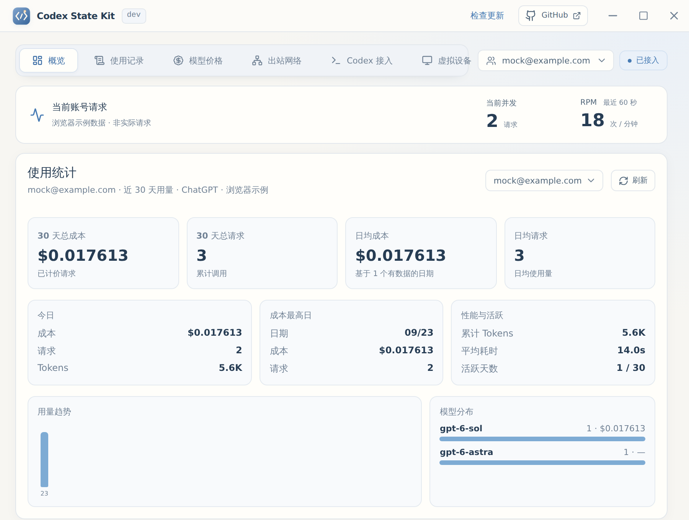

# Codex State Kit

面向 Codex 的本地桌面助手：在本机代理 Codex 的上游请求，管理多个 ChatGPT 账号、出站线路和虚拟设备，记录每次请求的用量与费用，并按官方客户端的信号标记被降智的请求。

基于 Tauri、Rust 和 React。实际效果受账号、网络和上游服务影响，不保证消除过载或提升模型能力。

## 使用说明

启动 Kit，添加 ChatGPT 账号并选好出站线路即可。路由只在 Kit 运行期间生效；正常退出后会还原本地原有配置。



1. 安装并启动 Codex State Kit，在「Codex 接入」页确认「Codex 工作目录」与 Codex 客户端使用的配置目录一致，一般为用户目录下的 `.codex`。同一时间只能运行一个 Kit。
2. 在「Codex 接入」页点击「添加账号」，用浏览器回调、授权码、Refresh Token 或 Access Token 登录 ChatGPT。登录请求走当前出站线路，新账号随后绑定这条线路。
3. 在「出站网络」中选择手动代理或订阅节点。只开了 Clash 等软件的系统代理（未开 TUN）时，Kit 会经系统代理连到手动代理。
4. 界面显示「已接入」后，重启 Codex 客户端以加载本机路由。
5. 使用期间保持 Kit 运行。正常退出后，再重启 Codex，即可回到退出前的官方账号与本地配置。

## 主要功能

- **多账号切换**：账号列表或托盘菜单一键切换，立即生效，无需重启 Codex。每个账号绑定自己的虚拟设备和出站线路，切换时一起换。
- **出站网络**：手动代理支持 socks5 / socks5h / http，出口可写成 `{session}` 由 Kit 生成会话；也可导入 Clash / Mihomo 订阅，由内置内核选择节点。
- **使用记录**：逐条记录请求模型、实际转发的模型、上游响应模型、传输方式、首字与总耗时、输入 / 缓存 / 输出用量和费用，分页查看，重启不丢失。
- **降智识别**：按官方 Codex 客户端的判断方式读取上游信号。`openai-model` 与请求模型不一致时标记为「已降级」；触发安全缓冲、收到账号验证建议或只有响应体模型不一致时标记为「疑似降智」。点击标记可查看判定依据，新的降智请求会弹出提醒。
- **模型价格**：与 [sub2api](https://github.com/Wei-Shaw/sub2api) 的 Codex 价格表对齐，定期比对并自动同步，按输入、缓存读写、输出和服务档位计费。
- **虚拟设备**：转发时统一替换客户端身份（设备标识、版本、系统信息），账号之间互不混用。
- **强制绑定模型**：可指定上游模型 ID（如 `gpt-6-astra`），下游无论请求什么模型都会改成该值再转发。
- **版本更新**：正式版启动时及每 6 小时检查 GitHub 最新正式版，支持应用内下载签名更新包、确认后安装重启，也可跳转发布页。
- **配置兼容**：接入期间保留已有 `service_tier`；旧版曾移除的值可从恢复记录自动补回。

## 网络路径

```text
Codex 客户端 ── 本机代理（Kit） ── 出站线路（手动代理 / 订阅节点） ── Codex 上游
```

业务请求优先走上游 WebSocket，握手失败时回退 HTTP SSE。正式版本机代理默认监听 `127.0.0.1:8787`。

## 文档导航

| 文档 | 内容 |
| --- | --- |
| [账号与登录](docs/accounts.md) | 添加账号、切换与环境绑定、登录文件 |
| [出站代理](docs/outbound.md) | 手动代理、订阅节点与系统代理串联 |
| [使用记录与降智识别](docs/usage-records.md) | 记录字段、指标口径、降智判定与数据边界 |
| [计费与模型价格](docs/billing.md) | 价格同步、计费公式、结算与存储 |
| [配置与自动接入](docs/config.md) | 工作目录、文件位置、路由恢复、高级设置 |
| [常见问题](docs/troubleshooting.md) | 登录、网络、接入与恢复排查，问题报告 |
| [开发与打包](docs/development.md) | 环境、命令、版本和安装包 |
| [自动更新发布](docs/updater.md) | 更新签名、Secrets 与发布流程 |
| [界面与图标](docs/ui-theme.md) | 布局、配色、图标维护 |

## 本地开发

准备 Node.js、项目指定的 pnpm、Rust stable 和 [Tauri 开发依赖](https://v2.tauri.app/start/prerequisites/)，在仓库根目录运行：

```sh
corepack pnpm install --frozen-lockfile
corepack pnpm dev
```

构建安装包使用 `corepack pnpm build`。完整说明见[开发与打包](docs/development.md)。

发布版本时推送 `v` 开头的标签，例如 `v0.0.1`，GitHub Actions 会自动构建并发布 Windows 与 macOS 安装包。

## 第三方组件

订阅节点使用第三方开源内核 Mihomo，来源和许可证见[内核来源记录](src-tauri/resources/mihomo/PROVENANCE.md)。上游许可证与依赖声明保留原文。
