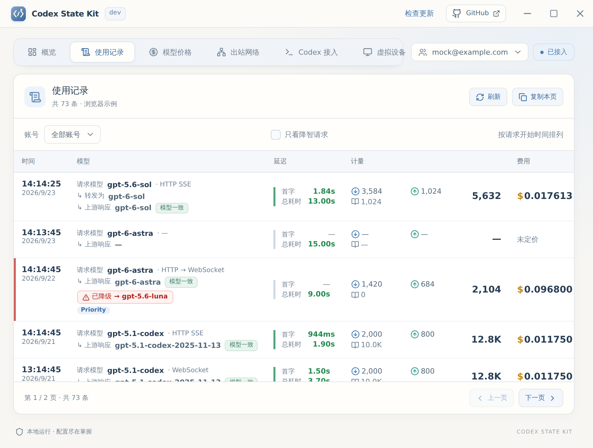

# 使用记录与降智识别

[返回首页](../README.md)

每次经 Kit 转发的 Codex 请求都会留下一条使用记录：用哪个账号、请求了什么模型、上游实际用了什么模型、耗时、用量和费用。记录保存在本机数据库，重启和切换账号都不会丢失。计费口径见[计费与模型价格](billing.md)。

## 概览

「概览」页上方的「当前账号请求」显示当前登录账号的实时流量：

- **当前并发**：从请求发往上游起，到响应结束、失败或取消止，包含等待响应头的时间。
- **RPM**：最近 60 秒内发起的请求次数，失败请求也计入。

这两项只统计本进程观测到的业务流量，按转发时生效的账号分开计数，切换账号不会混合；退出应用后清空。页面每秒更新一次。

下方「使用统计」按账号汇总：「累计成本」是该账号从第一条记录起的全部成本；其余是近 30 天的数据：总成本、总请求、日均成本和请求、今日、成本最高的一天、累计 Tokens、平均耗时、活跃天数、每日用量趋势和模型分布。成本只累加已计价的请求，有未计价的请求（没有对应价格或上游没返回用量）时会注明条数，不会因为一条未计价就整体显示「—」。只有更早用量的账号也可以在账号下拉里选到。

「使用统计」和「使用记录」默认每 1 秒自动刷新，可在「刷新」按钮旁改成 3、5、10、30 秒或关闭，两处共用同一个设置。自动刷新每次只询问记录有没有变化，有新请求或请求结束时才重新读取，读取时不会跳回表格顶部；窗口最小化或切到其他页时暂停。

## 使用记录

「使用记录」页按请求开始时间倒序列出记录。底部分页可以翻页，并选择每页 20、50、100 或 200 条（默认 50，会记住）。可以按账号筛选，勾选「只看降智请求」只显示被标记的请求。账号显示为邮箱：记录里没有邮箱时（例如旧版本记下的官方 Codex WebSocket 请求），用已保存登录的邮箱代替。

| 列 | 内容 |
| --- | --- |
| 时间 | 请求开始的时间和日期 |
| 模型 | 请求模型与传输方式（HTTP、HTTP SSE、HTTP → WebSocket、WebSocket）；强制绑定模型时显示「转发为」；上游响应模型及「模型一致 / 模型不一致」；服务档位（Priority、Flex）和长上下文标记；降智标记 |
| 延迟 | 首字和总耗时。首字 5 秒内为绿、15 秒以上为红；总耗时 60 秒内为绿、180 秒以上为红 |
| 计量 | 非缓存输入、输出（含推理）、缓存读、缓存写，以及输入 + 输出的总 Tokens |
| 费用 | 本次估算成本；悬停可看输入、缓存读、缓存写、输出各项；用量不完整时显示「缺少用量」，已有完整用量但没有匹配价格时显示「未定价」 |

上游响应模型参考 [sub2api 的模型观察逻辑](https://github.com/Wei-Shaw/sub2api/blob/main/backend/internal/service/upstream_response_model.go)，从 SSE / JSON 的 `response.model` 或顶层 `model` 提取；结束事件中的值优先。只读取响应元数据，不从生成文本或工具参数里找模型名。带日期的快照名（如 `gpt-5.1-codex-2025-11-13`）也算一致。这里记录的是上游声明的名称，单凭它不能证明实际运行的模型，降智判断见下一节。

### 指标口径

- **首字**：请求进入本机代理到收到首个非空文本、拒绝文本、工具参数/输入或图片分片事件的时间。参考 [sub2api 的真实可见输出口径](https://github.com/Wei-Shaw/sub2api/blob/main/frontend/src/i18n/locales/zh/admin/settings.ts)，响应头、心跳、`response.created` 和空 delta 不计入；推理等待计入首字延迟。
- **总耗时**：请求进入代理到响应体读完或中断的时间，包括上传请求、等待上游和流式传输。由于保持下游背压，慢客户端也可能增加此耗时。
- **用量**：只采信上游返回的 `usage`，不按字符数或分块数估算。推理 Tokens 已包含在输出中。

没有可识别的可见输出或用量时，相应指标显示「—」。zstd、gzip、deflate 响应会在统计旁路增量解压，原始字节和响应头原样转发。SSE 单个事件或非流式 JSON 的统计读取上限为 128 KiB，超过时跳过该部分统计，但继续原样转发。

业务 SSE 在已有数据块后静默约 90 秒、或响应头后一直没有正文约 180 秒时，Kit 会写入 `response.incomplete` 并断开，让 Codex 结束本轮并可以重试。客户端在收到 `response.completed` 后停止读取属于正常完成；此前就断开的请求按中断记录。

## 降智识别

判断方式与官方 Codex 客户端（`codex-rs`）一致，只看上游自己给出的信号：

| 信号 | 来源 | 结论 |
| --- | --- | --- |
| `openai-model` / `x-openai-model` 与请求模型不一致（不区分大小写） | 响应头、WebSocket 握手头或流事件里的 `headers` | **已降级**。官方客户端据此提示「请求被改路由到备用模型」 |
| 安全缓冲（safety buffering）：`x-codex-safety-buffering-enabled: true`，或流事件带 `safety_buffering` 对象 | 响应头、流事件、`response.metadata` | **疑似降智**。上游对本轮做额外安全审查，官方客户端会提示可以改用更快的模型重试；本轮本身没有被改路由 |
| `openai_verification_recommendation`（如 `trusted_access_for_cyber`） | `response.metadata` 事件 | **疑似降智**。账号被建议完成验证，被改路由的账号会收到该提示 |
| 只有响应体里的模型名不一致 | `response.model` | **疑似降智** |

`x-codex-turn-state` 长度、`x-codex-primary-used-percent` 和最小的 `encrypted_content` 块大小只作为参考记录，不参与判断。

被标记的请求在「模型」列显示红色「已降级 → 实际模型」或橙色「疑似降智」，点击标记弹出判定依据。Kit 运行期间出现新的降智请求时，右下角会弹出提醒，可直接跳到使用记录。降智结果随记录一起保存，重启后仍可筛选。

## 请求日志与诊断日志

Kit 在内存中保留最近 80 条请求日志，用于补全正在进行的请求的耗时，退出应用后清空。

排查卡住时另有一份落盘诊断日志：用户目录下的 `.codex-state-kit-diag.jsonl`（开发模式为 `.codex-state-kit-dev-diag.jsonl`）。按请求写入 `request` / `headers` / `first_token` / `chunk` / `finish`，只记模型、线路、SSE 事件类型和流进度，不写 cookie、请求体或生成文本。超过约 8 MB 会轮换成同名 `.1`。

## 数据边界

记录按 ChatGPT 账号 ID 归属，邮箱只作展示；邮箱随请求使用的登录信息一起记录，切换账号不会改变历史记录。每条请求的账号在转发前固定，旧账号的流式响应晚于切换结束，仍记在旧账号下。

使用记录和日志不保存 Authorization、Cookie、API key、代理用户名或密码、请求体、响应体和 URL query。错误只记录 `connect`、`timeout` 等类别，不复制完整的上游错误内容。
